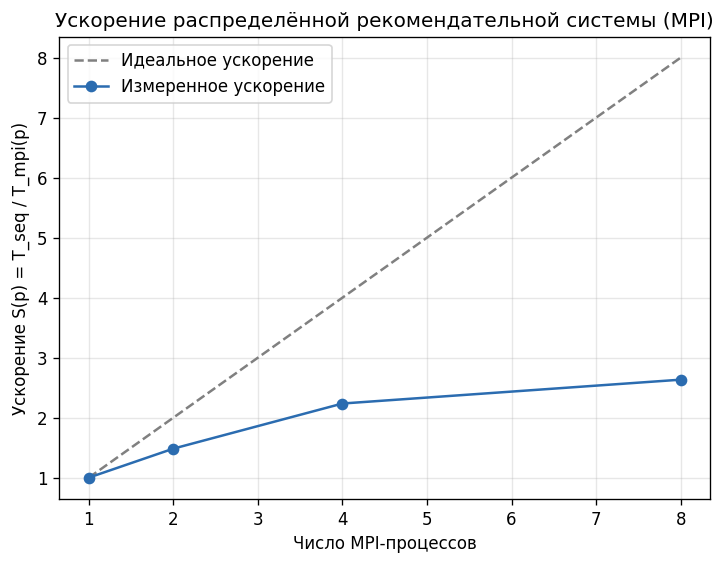

# Распределённая рекомендательная система на MPI (mpi4py)

Прототип рекомендательной системы на основе коллаборативной фильтрации
(user-based CF), работающей в распределённой среде MPI. Вычисления делятся между
процессами через mpi4py и агрегируются на главном процессе; измеряется ускорение
относительно последовательной версии.

Датасет — MovieLens ml-latest-small (~100k оценок, 610 пользователей, 9724 фильма),
скачивается автоматически при первом запуске.

## Соответствие заданию

| # | Требование | Файл |
|---|------------|------|
| 1 | Загрузка оценок фильмов | `src/data_loader.py` |
| 2 | Распределение вычислений по MPI | `src/recommender_mpi.py` |
| 3 | Построение рекомендаций | `src/cf_core.py` |
| 4 | Агрегация на главном процессе (`comm.gather`) | `src/recommender_mpi.py` |
| 5 | Измерение ускорения | `src/benchmark.py` |

## Алгоритм

User-based CF: оценки центрируются по среднему пользователя, близость — косинусная.
Прогноз — взвешенное по `top-K` соседям среднее, рекомендуются `top-N` неоценённых
фильмов. По умолчанию `top_k=40`, `top_n=10`.

## Параллелизм (MPI)

rank 0 загружает данные и строит модель → `Bcast` модели всем процессам →
пользователи делятся на равные части между рангами → каждый ранг считает свою долю →
`gather` результатов на rank 0.

## Установка и запуск

Нужен MPI-рантайм (Windows — MS-MPI, Linux — mpich/openmpi).

```bash
pip install -r requirements.txt

python src/recommender_seq.py --users 3        # последовательная версия
mpiexec -n 4 python src/recommender_mpi.py     # MPI на 4 процессах
python src/benchmark.py --procs 1 2 4 8        # бенчмарк ускорения
python tests/test_correctness.py               # тест корректности
```

На Windows: `.\run.ps1 seq | mpi 4 | bench`.

## Результаты (22-ядерный CPU, BLAS=1 поток на процесс)

| Процессы | Время, c | Ускорение | Эффективность |
|---------:|---------:|----------:|--------------:|
| seq      | 1.691    | 1.00×     | —             |
| 1        | 1.690    | 1.00×     | 1.00          |
| 2        | 1.140    | 1.48×     | 0.74          |
| 4        | 0.756    | 2.24×     | 0.56          |
| 8        | 0.642    | 2.63×     | 0.33          |



`S(1)≈1.00` — накладные расходы MPI малы. Падение эффективности с ростом `p`
объясняется законом Амдала и memory-bound характером задачи на небольшом датасете.

## Структура

```
src/data_loader.py        загрузка MovieLens, матрица оценок
src/cf_core.py            ядро коллаборативной фильтрации
src/recommender_seq.py    последовательная версия
src/recommender_mpi.py    распределённая MPI-версия
src/benchmark.py          измерение ускорения
src/_threadcap.py         BLAS=1 поток для честного замера
tests/test_correctness.py распределённый результат == последовательному
```
